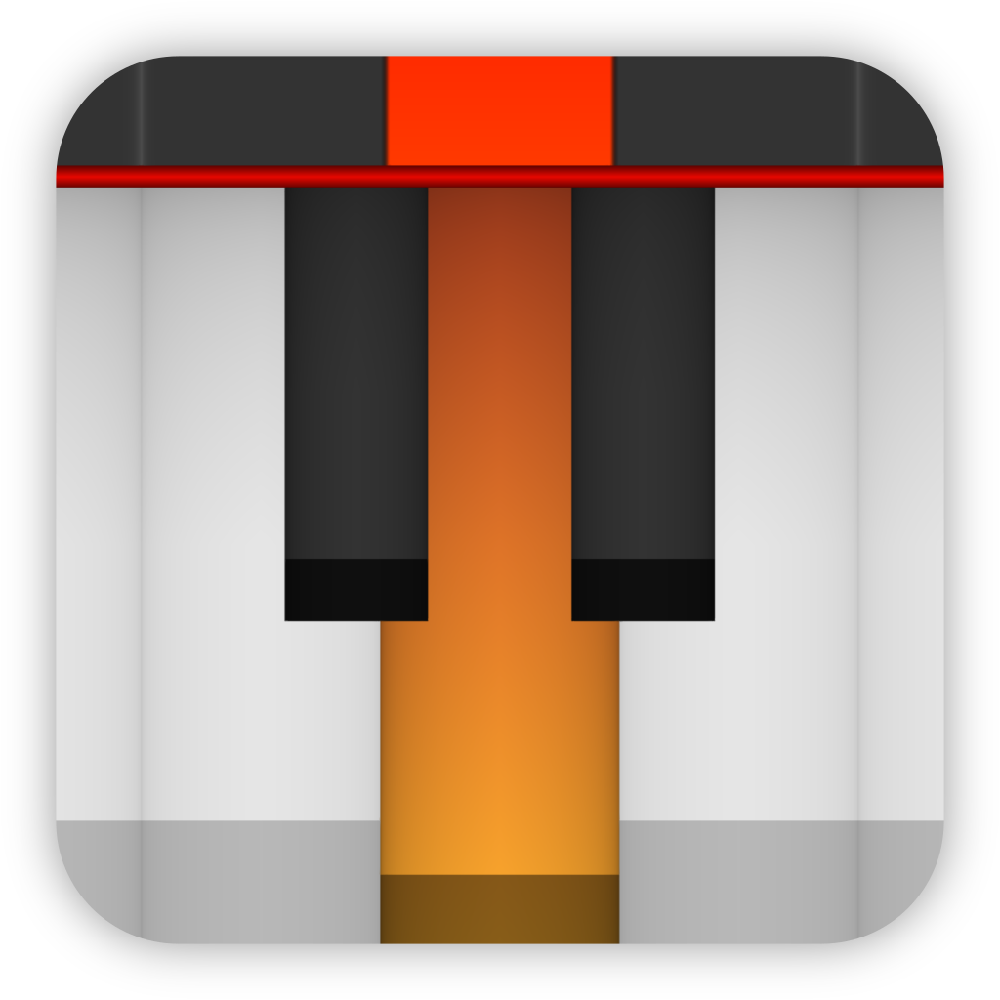

【☰】Table of Contents 👆

<div align="justify">

<div align="center">
  

  <h1>Pianola</h1>

  
  
  
  
  <a href="https://t.me/brokensource">
    
  </a>
  <a href="https://discord.gg/KjqvcYwRHm">
    
  </a>

  <sub> 👆 Out of the many **Explorers**, you can be among the **Shining** stars who support us! ⭐️ </sub>

  <br>

  **[**Pianola**](https://github.com/BrokenSource/Pianola)**: World's Smoothest and Most Customizable Piano Roll
</div>


<br>
<br>

# 📦 Installation

**Pianola** directly uses [**ShaderFlow**](https://github.com/BrokenSource/ShaderFlow). _Check it out!_ 🚀

<br>

> 🔴🟡🟢&nbsp; **For Extra** and **Alternative Installation Help**, check out the [**Monorepo**](https://github.com/BrokenSource/BrokenSource#-running-from-the-source-code)
>
> - **💠 Windows**: Open a Folder, Press <kbd>Ctrl+L</kbd>, Run `powershell` and execute
>   ```ps
>   irm https://brakeit.github.io/get.ps1 | iex
>   ```
>
> - **🐧 Linux and MacOS 🍎**: Open a Terminal in some Directory and run
>   ```ps
>   /bin/bash -c "$(curl -sS https://brakeit.github.io/get.sh)"
>   ```
> <sub><b>⚠️ Warning:</b> Recent Tooling changes may cause new issues. Get in touch for any issues 🤝</sub>
>
> <sub><b>Note:</b> The commands above are safe. You can read what they do <b><a href="https://github.com/Brakeit/brakeit.github.io">here</a></b>.</sub>

<br>

After activating the Virtual Environment on `.venv`:
- Run `pianola` for a real-time window
- Run `pianola --help` for rendering options

<br>
<br>

# ⚖️ License

**See [BrokenSource](https://github.com/BrokenSource/BrokenSource) Repository** for the License of the Code, Assets, Projects and User Generated Content

- **Pianola** Shader is CC-BY-SA 4.0, just attribute on videos and same-license modifications :)

</div>